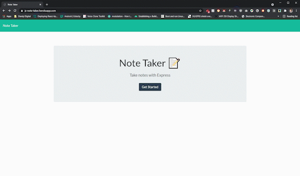

# Express.js Note Taker 

<p align="center">
  
</p>
<p align="center">

  <p align="center">
    <br />
    <a href="https://js-note-taker.herokuapp.com/">Live Demo</a>
  </p>
</p>

<!-- TABLE OF CONTENTS -->
<details open="open">
  <summary>Table of Contents</summary>
  <ol>
    <li>
      <a href="#overview">Overview</a>
      <ul>
        <li><a href="#technologies-used">Technologies Used</a></li>
        <li><a href="#acceptance-criteria">Acceptance Criteria</a></li>
      </ul>
    </li>
    <li>
      <a href="#getting-started">Getting Started</a>
      <ul>
        <li><a href="#prerequisites">Prerequisites</a></li>
        <li><a href="#installation">Installation</a></li>
      </ul>
    </li>
    <li><a href="#future-improvements">Future Improvements</a></li>
    <li><a href="#license">License</a></li>
  </ol>
</details>
<br>

## Overview

This Express.js web application allows users to write and save notes. User notes are stored in and retrieved from a JSON file. The purpose behind the development of this project was to demonstrate the ability to utilize Express.js to build a functional web application back-end.

### Technologies Used

The application uses the following packages:

- [Node.js](https://nodejs.org/en/)
- [Express.js](https://expressjs.com/)
- [Nodemon](https://github.com/remy/nodemon)

### Acceptance Criteria

```
GIVEN a note-taking application
WHEN I open the Note Taker
THEN I am presented with a landing page with a link to a notes page
WHEN I click on the link to the notes page
THEN I am presented with a page with existing notes listed in the left-hand column, plus empty fields to enter a new note title and the note’s text in the right-hand column
WHEN I enter a new note title and the note’s text
THEN a Save icon appears in the navigation at the top of the page
WHEN I click on the Save icon
THEN the new note I have entered is saved and appears in the left-hand column with the other existing notes
WHEN I click on an existing note in the list in the left-hand column
THEN that note appears in the right-hand column
WHEN I click on the Write icon in the navigation at the top of the page
THEN I am presented with empty fields to enter a new note title and the note’s text in the right-hand column
```

## Getting Started

To get a local copy of this project up and running follow these simple steps.

### Prerequisites

First you must install [Node.js](https://nodejs.org/en/) and [NPM](https://www.npmjs.com/get-npm) if you haven't done so already. Once this is done, follow the installation instructions below to run the application locally.

### Installation

1. Clone the repository.
   ```sh
   git clone https://github.com/kevin-aminzadeh/express-note-taker
   ```
2. Navigate to the repository directory and run the following command to install the necessary NPM packages.
   ```sh
   npm install
   ```
3. Run the app start script.
   ```sh
   npm start
   ```

This project uses the `Nodemon` NPM package to enable hot reloading of the server during development. In order to utilize this functionality, run the following script instead of the app start script:

```sh
npm run dev
```

## Future Improvements

Due to the relative simplicity of this project, there are plenty of available avenues for improvement.

Some noteworthy improvements which could be made include:

- Implementing user authentication/authorization.
- Utilizing a database in order to provide persistent storage of individual users' notes.

## License

This project is licensed under the terms of the [MIT license](https://opensource.org/licenses/MIT).
